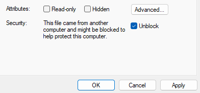
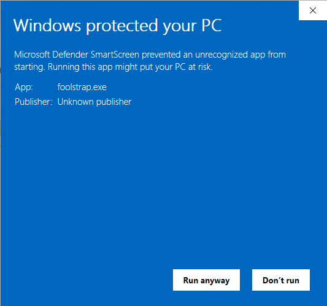
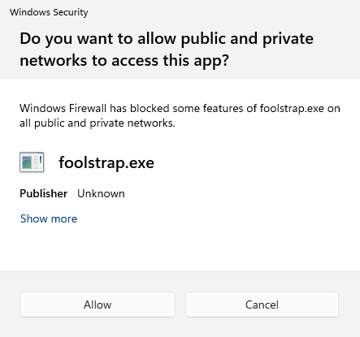

# foolstrap

Fool's trap is a lightweight Windows x64 program that sends back a fake banner as a reponse of a scan or a request.

As a socket listening server Fool's trap wait for an incoming connection on a TCP port on your Windows machine then reads the request of a client and sends a fake answer back to this client.

This tool can be used for:
- Cyberdeception
- Testing connectivity

It was tested on Windows 11 Home/Pro against telnet, nc and nmap.

By default Fool's trap listens on port TCP 11111.

# Installation

Installation is achieved in 3 steps.

## Step 1: Downloading

Installation is easy: just download the executable.

## Step 2: Allowing the program to be launched

Actually there is no threat but Windows Defender displays a warning message after downloading the executable. To avoid Windows Defender blue screen "Windows protected your PC" you have 2 options:

1. Right click on the file, check "Unblock" then click "Apply" button.



or

2. You run the executable then on the popup just click "More info" then "Run anyways".




## Step 3: Allowing access to the network (Windows Firewall)

Because the software use network connections to be connected to it then Windows Firewall shows another popup the first time to allow or block the application to get network access.

Just click "Allow" button.




# Usage

Run the program.

``` PowerShell
C:\>foolstrap.exe
Server running. Waiting for connection...
```

On a remote computer you can reach this server. Here are 2 examples of usage:

1. On a computer using telnet and the following command (adapt the command with the IP address of the server):

``` PowerShell
telnet 192.168.1.93 11111
```

Press Enter twice and you will get:

``` PowerShell

Welcome to Ubuntu 24.04.4 LTS (GNU/Linux 6.17.0-20-generic x86_64)

Connection to host lost.
PS C:\Users\tcm>
```

On the server you will read:

``` PowerShell
C:\>foolstrap.exe
Server running. Waiting for connection...
Client connected to this server: 192.168.1.93:59310

```

2. On a computer running nmap detecting the service a client would get:

``` bash
┌──(kali㉿kali)-[~]
└─$ time nmap -p 11111 -T4 -A 192.168.1.93
Starting Nmap 7.99 ( https://nmap.org ) at 2026-04-22 11:53 -0400
Nmap scan report for WKS01 (192.168.1.93)
Host is up (0.0012s latency).

PORT      STATE SERVICE VERSION
11111/tcp open  vce?
| fingerprint-strings: 
|   DNSStatusRequestTCP, DNSVersionBindReqTCP, FourOhFourRequest, GenericLines, GetRequest, HTTPOptions, Help, Kerberos, LDAPBindReq, LDAPSearchReq, LPDString, RPCCheck, RTSPRequest, SMBProgNeg, SSLSessionReq, TLSSessionReq, TerminalServerCookie, X11Probe: 
|_    Welcome to Ubuntu 24.04.4 LTS (GNU/Linux 6.17.0-20-generic x86_64)
1 service unrecognized despite returning data. If you know the service/version, please submit the following fingerprint at https://nmap.org/cgi-bin/submit.cgi?new-service :
SF-Port11111-TCP:V=7.99%I=7%D=4/22%Time=69E8EF0D%P=x86_64-pc-linux-gnu%r(G
SF:enericLines,43,"Welcome\x20to\x20Ubuntu\x2024\.04\.4\x20LTS\x20\(GNU/Li
SF:nux\x206\.17\.0-20-generic\x20x86_64\)\0")%r(GetRequest,43,"Welcome\x20
SF:to\x20Ubuntu\x2024\.04\.4\x20LTS\x20\(GNU/Linux\x206\.17\.0-20-generic\
SF:x20x86_64\)\0")%r(HTTPOptions,43,"Welcome\x20to\x20Ubuntu\x2024\.04\.4\
SF:x20LTS\x20\(GNU/Linux\x206\.17\.0-20-generic\x20x86_64\)\0")%r(RTSPRequ
SF:est,43,"Welcome\x20to\x20Ubuntu\x2024\.04\.4\x20LTS\x20\(GNU/Linux\x206
SF:\.17\.0-20-generic\x20x86_64\)\0")%r(RPCCheck,43,"Welcome\x20to\x20Ubun
SF:tu\x2024\.04\.4\x20LTS\x20\(GNU/Linux\x206\.17\.0-20-generic\x20x86_64\
SF:)\0")%r(DNSVersionBindReqTCP,43,"Welcome\x20to\x20Ubuntu\x2024\.04\.4\x
SF:20LTS\x20\(GNU/Linux\x206\.17\.0-20-generic\x20x86_64\)\0")%r(DNSStatus
SF:RequestTCP,43,"Welcome\x20to\x20Ubuntu\x2024\.04\.4\x20LTS\x20\(GNU/Lin
SF:ux\x206\.17\.0-20-generic\x20x86_64\)\0")%r(Help,43,"Welcome\x20to\x20U
SF:buntu\x2024\.04\.4\x20LTS\x20\(GNU/Linux\x206\.17\.0-20-generic\x20x86_
SF:64\)\0")%r(SSLSessionReq,43,"Welcome\x20to\x20Ubuntu\x2024\.04\.4\x20LT
SF:S\x20\(GNU/Linux\x206\.17\.0-20-generic\x20x86_64\)\0")%r(TerminalServe
SF:rCookie,43,"Welcome\x20to\x20Ubuntu\x2024\.04\.4\x20LTS\x20\(GNU/Linux\
SF:x206\.17\.0-20-generic\x20x86_64\)\0")%r(TLSSessionReq,43,"Welcome\x20t
SF:o\x20Ubuntu\x2024\.04\.4\x20LTS\x20\(GNU/Linux\x206\.17\.0-20-generic\x
SF:20x86_64\)\0")%r(Kerberos,43,"Welcome\x20to\x20Ubuntu\x2024\.04\.4\x20L
SF:TS\x20\(GNU/Linux\x206\.17\.0-20-generic\x20x86_64\)\0")%r(SMBProgNeg,4
SF:3,"Welcome\x20to\x20Ubuntu\x2024\.04\.4\x20LTS\x20\(GNU/Linux\x206\.17\
SF:.0-20-generic\x20x86_64\)\0")%r(X11Probe,43,"Welcome\x20to\x20Ubuntu\x2
SF:024\.04\.4\x20LTS\x20\(GNU/Linux\x206\.17\.0-20-generic\x20x86_64\)\0")
SF:%r(FourOhFourRequest,43,"Welcome\x20to\x20Ubuntu\x2024\.04\.4\x20LTS\x2
SF:0\(GNU/Linux\x206\.17\.0-20-generic\x20x86_64\)\0")%r(LPDString,43,"Wel
SF:come\x20to\x20Ubuntu\x2024\.04\.4\x20LTS\x20\(GNU/Linux\x206\.17\.0-20-
SF:generic\x20x86_64\)\0")%r(LDAPSearchReq,43,"Welcome\x20to\x20Ubuntu\x20
SF:24\.04\.4\x20LTS\x20\(GNU/Linux\x206\.17\.0-20-generic\x20x86_64\)\0")%
SF:r(LDAPBindReq,43,"Welcome\x20to\x20Ubuntu\x2024\.04\.4\x20LTS\x20\(GNU/
SF:Linux\x206\.17\.0-20-generic\x20x86_64\)\0");
MAC Address: 08:00:27:10:DA:1F (Oracle VirtualBox virtual NIC)
Warning: OSScan results may be unreliable because we could not find at least 1 open and 1 closed port
Device type: general purpose
Running (JUST GUESSING): Microsoft Windows 11|10|2008 (92%), FreeBSD 6.X (88%)
OS CPE: cpe:/o:microsoft:windows_11 cpe:/o:freebsd:freebsd:6.2 cpe:/o:microsoft:windows_10 cpe:/o:microsoft:windows_server_2008::beta3 cpe:/o:microsoft:windows_server_2008
Aggressive OS guesses: Microsoft Windows 11 24H2 (92%), Microsoft Windows 11 21H2 (91%), FreeBSD 6.2-RELEASE (88%), Microsoft Windows 10 (86%), Microsoft Windows Server 2008 or 2008 Beta 3 (85%), Microsoft Windows 10 1607 (85%)
No exact OS matches for host (test conditions non-ideal).
Network Distance: 1 hop

TRACEROUTE
HOP RTT     ADDRESS
1   1.21 ms WKS01 (192.168.1.93)

OS and Service detection performed. Please report any incorrect results at https://nmap.org/submit/ .
Nmap done: 1 IP address (1 host up) scanned in 19.84 seconds

real    19.95s
user    0.81s
sys     0.32s
cpu     5%
                                                                                                                                                                                                                                           
┌──(kali㉿kali)-[~]
└─$ 

```

The port is seen as open.


# Commands

Supported commands are:

"/v" or "-v" to get sofware version.

``` PowerShell
C:\>foolstrap.exe -v
Fool's Trap 1.0.0 by Glacius

C:\>
```


